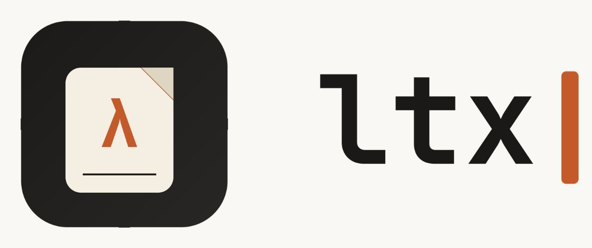

<div align="center">
  

  <h3>An extremely fast LaTeX project manager, written in Rust.</h3>

  <p>
    <a href="https://crates.io/crates/ltx"></a>
    <a href="https://docs.rs/ltx"></a>
    <a href="https://github.com/abderrahmanbenani/ltx/actions"></a>
    <a href="https://github.com/abderrahmanbenani/ltx/blob/main/LICENSE"></a>
    <a href="https://crates.io/crates/ltx"></a>
  </p>
</div>

<br>

`ltx` is a project manager for LaTeX documents. It resolves your document graph, drives `latex`/`xelatex`/`lualatex` and `biber`/`bibtex` in the right order, watches your sources for changes, and gets out of your way — built for people who'd rather be writing than babysitting a build.

> **Status:** pre-1.0. The CLI surface is stabilizing; expect minor breaking changes between minor versions until `1.0`. See [CHANGELOG.md](CHANGELOG.md).

---

## Table of contents

- [Why ltx](#why-ltx)
- [Features](#features)
- [Installation](#installation)
- [Quick start](#quick-start)
- [Usage](#usage)
- [Configuration](#configuration)
- [How it compares](#how-it-compares)
- [Project layout](#project-layout)
- [Contributing](#contributing)
- [License](#license)

## Why ltx

Most LaTeX workflows are stitched together from shell scripts, `latexmk`, and muscle memory. `ltx` treats your document the way a modern build tool treats a codebase:

- **Correct by construction** — dependency-aware compilation means bibliographies, indices, and multi-pass cross-references resolve without manual re-runs.
- **Fast** — incremental builds, parallel auxiliary passes, and a Rust core mean large multi-file theses and papers compile in a fraction of the time.
- **Predictable** — one `ltx.toml` describes your project; builds behave the same on your machine, your co-author's machine, and in CI.

## Features

- 🚀 **Incremental builds** — only recompiles what changed, including transitive `\input`/`\include` graphs
- 🔁 **Automatic multi-pass resolution** — handles `biber`/`bibtex`, `makeindex`, and repeated `pdflatex` passes until the document is stable
- 👀 **Watch mode** — rebuilds on save for a tight write–compile–preview loop
- 📦 **Project scaffolding** — `ltx new` generates a clean, opinionated project structure
- 🧹 **Clean workspace** — auxiliary files are isolated to a build directory, never scattered next to your `.tex` sources
- 🔌 **Engine-agnostic** — works with `pdflatex`, `xelatex`, and `lualatex`
- 🧵 **Parallel-friendly** — designed to slot into CI pipelines and pre-commit hooks

## Installation

### With Cargo

```bash
cargo install ltx
```

### From source

```bash
git clone https://github.com/abderrahmanbenani/ltx.git
cd ltx
cargo install --path .
```

`ltx` requires a working TeX distribution ([TeX Live](https://tug.org/texlive/), [MiKTeX](https://miktex.org/), or [MacTeX](https://tug.org/mactex/)) on your `PATH`.

## Quick start

```bash
# Scaffold a new project
ltx new my-paper
cd my-paper

# Build once
ltx build

# Rebuild on every save
ltx watch
```

## Usage

```bash
ltx build [--engine pdflatex|xelatex|lualatex] [--release]
ltx watch [--open]
ltx clean
ltx new <name> [--template article|report|beamer]
ltx doctor    # verify your TeX toolchain and diagnose common issues
```

Run `ltx --help` or `ltx <command> --help` for the full reference.

## Configuration

Every `ltx` project is described by an `ltx.toml` at its root:

```toml
[project]
name = "my-paper"
main = "src/main.tex"
engine = "pdflatex"

[build]
output-dir = "build"
bibliography = true

[watch]
open-viewer = true
```

## How it compares

| | `ltx` | `latexmk` | Plain shell scripts |
|---|:---:|:---:|:---:|
| Incremental builds | ✅ | ⚠️ partial | ❌ |
| Dependency-aware graph resolution | ✅ | ⚠️ heuristic | ❌ |
| Project scaffolding | ✅ | ❌ | ❌ |
| Config format | TOML | Perl | shell |
| Written in | Rust | Perl | — |

## Project layout

```
.
├── src/
│   ├── main.tex
│   └── sections/
├── bib/
│   └── references.bib
├── build/          # generated, git-ignored
└── ltx.toml
```

## Contributing

Contributions are welcome. Please open an issue before starting on a large change so we can align on direction first.

```bash
git clone https://github.com/abderrahmanbenani/ltx.git
cd ltx
cargo test
cargo clippy --all-targets -- -D warnings
```

See [CONTRIBUTING.md](CONTRIBUTING.md) for the full guide.

## License

Licensed under either of

- [Apache License, Version 2.0](LICENSE-APACHE)
- [MIT license](LICENSE-MIT)

at your option.

<div align="center">
  <sub>Built with 🦀 and ❤️ by <a href="https://github.com/abderrahmanbenani">Abderrahman</a></sub>
</div>
